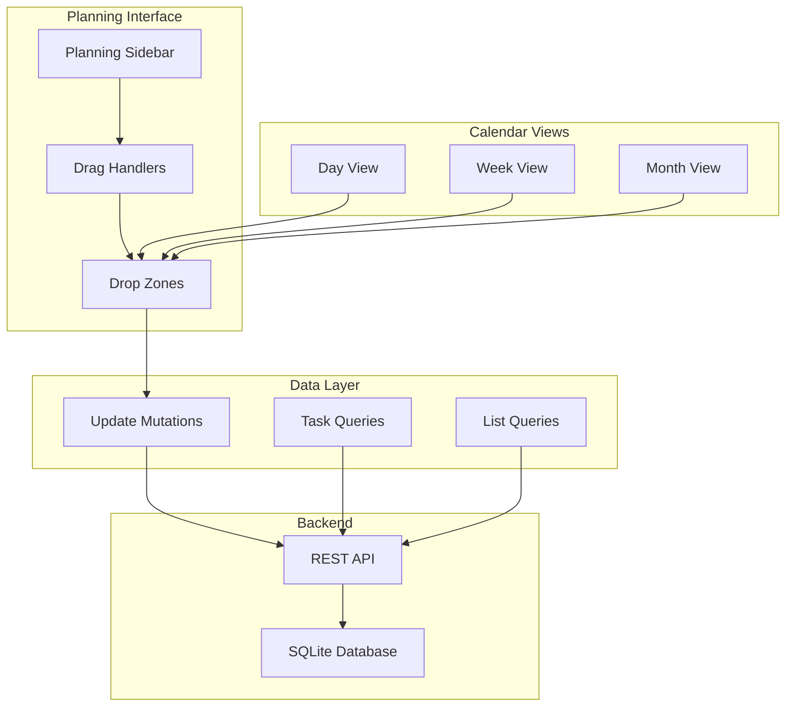

# Design Document

## Overview

The drag-and-drop planning feature extends the existing calendar application with a visual planning interface that allows users to schedule todos from their lists onto calendar dates. The feature integrates seamlessly with the existing lists and calendar systems, providing an intuitive drag-and-drop interface for task scheduling.

The design leverages the existing React Query architecture, TypeScript type system, and component structure while introducing new drag-and-drop capabilities using the HTML5 Drag and Drop API with React DnD for enhanced cross-device compatibility.

## Architecture

### High-Level Architecture



### Component Architecture

The planning feature introduces several new components that integrate with the existing calendar structure:

1. **Planningsidebar**: A collapsible sidebar showing all lists and their todos
2. **DraggableTodoItem**: Enhanced todo items with drag capabilities
3. **CalendarDropZone**: Drop target areas within calendar views
4. **DragDropProvider**: Context provider for drag-and-drop state management
5. **PlanningToggle**: UI control for showing/hiding the planning sidebar

### Data Flow

1. User initiates drag from planning sidebar
2. Drag context tracks the dragged todo and provides visual feedback
3. Calendar drop zones highlight when drag enters valid targets
4. On drop, the system updates the todo's scheduled date via API
5. React Query invalidates relevant caches and refetches data
6. UI updates to reflect the new schedule

## Components and Interfaces

### Core Components

#### PlanningsSidebar Component

```typescript
interface PlanningSidebarProps {
  isVisible: boolean;
  onToggle: () => void;
  className?: string;
}

interface PlanningSidebarState {
  expandedLists: Set<string>;
  searchQuery: string;
  filterCompleted: boolean;
}
```

**Responsibilities:**
- Display all lists in a hierarchical structure
- Show todos grouped by their parent lists
- Provide search and filtering capabilities
- Handle list expansion/collapse state
- Render draggable todo items

#### DraggableTodoItem Component

```typescript
interface DraggableTodoItemProps {
  todo: Task;
  listName: string;
  listEmoji: string;
  onDragStart?: (todo: Task) => void;
  onDragEnd?: () => void;
  className?: string;
}

interface DragData {
  todoId: string;
  todoTitle: string;
  listId: string;
  listName: string;
  currentScheduledDate?: Date;
}
```

**Responsibilities:**
- Render todo with drag handle
- Implement HTML5 drag events
- Provide drag preview with todo information
- Handle drag state visual feedback

#### CalendarDropZone Component

```typescript
interface CalendarDropZoneProps {
  date: Date;
  view: 'day' | 'week' | 'month';
  onDrop: (todoId: string, date: Date) => void;
  children: React.ReactNode;
  className?: string;
}

interface DropZoneState {
  isActive: boolean;
  isOver: boolean;
  canDrop: boolean;
}
```

**Responsibilities:**
- Define drop target areas within calendar views
- Provide visual feedback during drag operations
- Validate drop operations
- Execute drop actions

#### DragDropProvider Component

```typescript
interface DragDropContextValue {
  draggedTodo: Task | null;
  isDragging: boolean;
  dragPreview: React.ReactNode | null;
  setDraggedTodo: (todo: Task | null) => void;
  setDragPreview: (preview: React.ReactNode | null) => void;
}
```

**Responsibilities:**
- Manage global drag-and-drop state
- Provide drag context to child components
- Handle drag preview rendering
- Coordinate drag operations across components

### Enhanced Existing Components

#### Calendar Page Updates

The main calendar page will be enhanced to:
- Include the planning sidebar
- Manage sidebar visibility state
- Coordinate drag-and-drop operations
- Handle todo scheduling mutations

#### Calendar View Updates

Day, Week, and Month views will be enhanced with:
- Drop zone integration
- Visual feedback for drag operations
- Responsive layout adjustments when sidebar is visible

## Data Models

### Extended Task Interface

The existing Task interface will be enhanced with scheduling-related properties:

```typescript
interface TaskWithScheduling extends Task {
  scheduledDate?: Date;
  isScheduled: boolean;
  schedulingSource: 'manual' | 'drag-drop' | 'form';
}
```

### Planning State Interface

```typescript
interface PlanningState {
  sidebarVisible: boolean;
  sidebarWidth: number;
  expandedLists: Set<string>;
  dragState: {
    isDragging: boolean;
    draggedTodo: Task | null;
    dragStartTime: number;
    dragSource: 'sidebar' | 'calendar';
  };
  dropState: {
    activeDropZone: string | null;
    validDropZones: Set<string>;
  };
}
```

### API Extensions

New API endpoints and request types:

```typescript
interface ScheduleTodoRequest {
  todoId: string;
  scheduledDate: Date;
  previousDate?: Date;
}

interface BulkScheduleRequest {
  operations: Array<{
    todoId: string;
    scheduledDate: Date;
  }>;
}

interface PlanningPreferencesRequest {
  sidebarVisible: boolean;
  sidebarWidth: number;
  autoExpandLists: boolean;
  showCompletedTodos: boolean;
}
```

## Error Handling

### Drag and Drop Error Scenarios

1. **Network Failures During Drop**
   - Implement optimistic updates with rollback
   - Show retry mechanisms for failed operations
   - Maintain visual consistency during network issues

2. **Invalid Drop Targets**
   - Validate drop zones before allowing drops
   - Provide clear visual feedback for invalid operations
   - Show helpful error messages

3. **Concurrent Modifications**
   - Handle conflicts when todos are modified during drag operations
   - Implement conflict resolution strategies
   - Refresh data when conflicts are detected

### Error Recovery Strategies

```typescript
interface DragDropErrorHandler {
  handleDropFailure: (error: Error, todo: Task, targetDate: Date) => void;
  handleNetworkError: (operation: string, retryFn: () => Promise<void>) => void;
  handleConflictError: (conflictData: any) => void;
}
```

## Testing Strategy

### Unit Testing

1. **Component Testing**
   - Test drag and drop event handlers
   - Verify visual feedback states
   - Test keyboard accessibility
   - Validate prop handling and state management

2. **Hook Testing**
   - Test custom drag-and-drop hooks
   - Verify state management logic
   - Test error handling scenarios

3. **Utility Testing**
   - Test date calculation utilities
   - Verify drag data serialization/deserialization
   - Test validation functions

### Integration Testing

1. **Drag and Drop Workflows**
   - Test complete drag-and-drop operations
   - Verify data persistence after drops
   - Test cross-component interactions

2. **API Integration**
   - Test scheduling API calls
   - Verify optimistic updates and rollbacks
   - Test error handling and retry logic

3. **Responsive Behavior**
   - Test sidebar responsiveness
   - Verify touch device compatibility
   - Test different screen sizes

### End-to-End Testing

1. **User Workflows**
   - Test complete planning workflows
   - Verify cross-browser compatibility
   - Test accessibility compliance

2. **Performance Testing**
   - Test with large numbers of todos
   - Verify smooth drag operations
   - Test memory usage during extended use

## Performance Considerations

### Optimization Strategies

1. **Virtual Scrolling**
   - Implement virtual scrolling for large todo lists
   - Lazy load todos as needed
   - Optimize rendering performance

2. **Drag Performance**
   - Debounce drag events
   - Optimize drag preview rendering
   - Minimize re-renders during drag operations

3. **Data Fetching**
   - Implement intelligent caching strategies
   - Prefetch related data
   - Use React Query's background updates

### Memory Management

1. **Event Listener Cleanup**
   - Properly remove drag event listeners
   - Clean up intersection observers
   - Manage component lifecycle properly

2. **State Management**
   - Minimize state updates during drag operations
   - Use refs for frequently changing values
   - Implement proper cleanup in useEffect hooks

## Accessibility

### Keyboard Navigation

1. **Drag and Drop Alternatives**
   - Implement keyboard-based scheduling
   - Provide context menus for scheduling actions
   - Support screen reader announcements

2. **Focus Management**
   - Maintain proper focus during drag operations
   - Provide clear focus indicators
   - Support tab navigation through planning interface

### Screen Reader Support

1. **ARIA Labels**
   - Provide descriptive labels for drag handles
   - Announce drag and drop operations
   - Label drop zones clearly

2. **Live Regions**
   - Announce successful scheduling operations
   - Provide feedback for failed operations
   - Update screen readers on state changes

## Security Considerations

### Input Validation

1. **Drag Data Validation**
   - Validate todo IDs before processing drops
   - Sanitize date inputs
   - Verify user permissions for todo modifications

2. **API Security**
   - Implement proper authentication for scheduling operations
   - Validate user ownership of todos
   - Rate limit scheduling operations

### XSS Prevention

1. **Data Sanitization**
   - Sanitize todo titles and descriptions
   - Escape user-generated content
   - Validate drag data payloads

## Browser Compatibility

### Drag and Drop Support

1. **HTML5 Drag and Drop**
   - Support modern browsers with native drag and drop
   - Provide fallbacks for older browsers
   - Handle touch device interactions

2. **Touch Device Support**
   - Implement touch-based drag and drop
   - Provide alternative interaction methods
   - Test on various mobile devices

### Progressive Enhancement

1. **Fallback Mechanisms**
   - Provide non-drag alternatives for scheduling
   - Ensure core functionality works without JavaScript
   - Graceful degradation for unsupported features

## Deployment Considerations

### Feature Flags

1. **Gradual Rollout**
   - Implement feature flags for drag-and-drop functionality
   - Allow selective enabling for user groups
   - Monitor performance and user feedback

2. **A/B Testing**
   - Test different UI approaches
   - Measure user engagement with planning features
   - Optimize based on usage patterns

### Monitoring

1. **Performance Metrics**
   - Track drag operation performance
   - Monitor API response times for scheduling
   - Measure user engagement with planning features

2. **Error Tracking**
   - Monitor drag and drop failures
   - Track API errors and retry rates
   - Identify common user issues