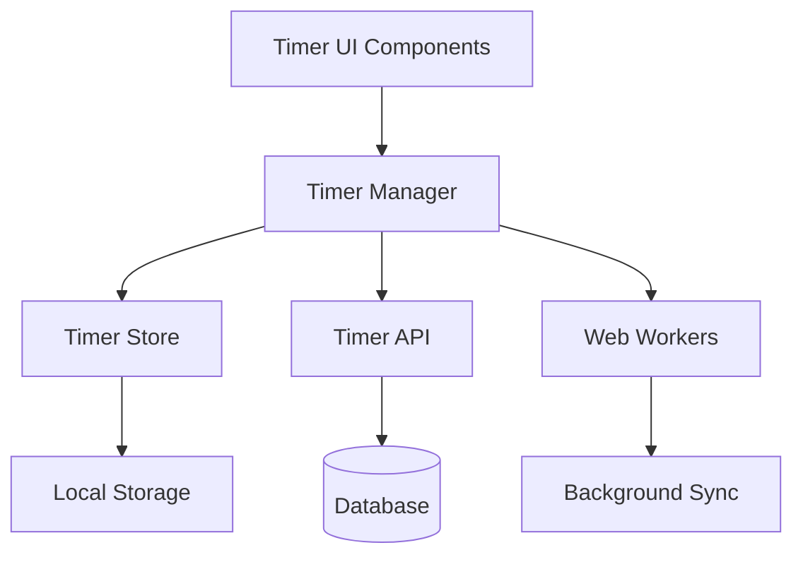

# Design Document

## Overview

The task time tracker feature integrates seamlessly with the existing todo application to provide comprehensive time tracking capabilities. The system uses a robust client-server architecture with persistent storage, real-time updates, and recovery mechanisms to ensure accurate time tracking even when the application is backgrounded or closed.

## Architecture

### High-Level Architecture



### Component Layers

1. **Presentation Layer**: React components for timer controls, displays, and confirmations
2. **State Management Layer**: Global timer state with React Context and custom hooks
3. **Service Layer**: Timer logic, persistence, and synchronization services
4. **API Layer**: RESTful endpoints for timer operations and data persistence
5. **Data Layer**: PostgreSQL tables for time tracking data with Drizzle ORM

## Components and Interfaces

### Frontend Components

#### Core Timer Components

**TimerProvider**
- Global context provider for timer state management
- Manages active timer, accumulated times, and daily summaries
- Handles timer recovery on application restart

**TimerDisplay**
- Shows current running timer with elapsed time
- Displays progress against estimated duration
- Provides start/pause/stop controls

**TaskTimerButton**
- Integrated into existing task components
- Shows timer status for each task
- Handles timer switching with confirmation

**DailySummary**
- Shows total time spent today
- Displays progress toward 8-hour target
- Lists time breakdown by task

**TimerSwitchModal**
- Confirmation dialog for switching between active timers
- Shows current and target task information
- Provides clear action buttons

#### Integration Points

**Enhanced Task Components**
- Modify existing `SelectableTodoItem` to include timer controls
- Update `TodoDetailPane` to show time tracking information
- Integrate timer display into `DayView` and other calendar views

### Backend API Endpoints

```typescript
// Timer session management
POST   /api/timers/start     // Start timer for a task
POST   /api/timers/pause     // Pause current timer
POST   /api/timers/resume    // Resume paused timer
POST   /api/timers/stop      // Stop and save timer session

// Time tracking data
GET    /api/timers/active    // Get current active timer
GET    /api/timers/daily     // Get daily time summary
GET    /api/timers/task/:id  // Get time data for specific task
POST   /api/timers/sync     // Sync timer state after recovery
```

### Service Classes

**TimerService**
- Core timer logic and state management
- Handles timer start, pause, resume, stop operations
- Manages timer switching and confirmation flow

**PersistenceService**
- Handles data persistence to localStorage and server
- Manages offline queue for timer events
- Implements recovery mechanisms

**SyncService**
- Synchronizes timer state between client and server
- Handles conflict resolution for concurrent sessions
- Manages background sync when application is inactive

## Data Models

### Database Schema Extensions

```sql
-- Timer sessions table
CREATE TABLE timer_sessions (
  id VARCHAR PRIMARY KEY DEFAULT gen_random_uuid(),
  task_id VARCHAR NOT NULL REFERENCES tasks(id) ON DELETE CASCADE,
  start_time TIMESTAMP NOT NULL,
  end_time TIMESTAMP,
  duration_seconds INTEGER DEFAULT 0,
  is_active BOOLEAN DEFAULT false,
  created_at TIMESTAMP DEFAULT NOW(),
  updated_at TIMESTAMP DEFAULT NOW()
);

-- Task time estimates table
CREATE TABLE task_estimates (
  id VARCHAR PRIMARY KEY DEFAULT gen_random_uuid(),
  task_id VARCHAR NOT NULL REFERENCES tasks(id) ON DELETE CASCADE,
  estimated_duration_minutes INTEGER NOT NULL,
  created_at TIMESTAMP DEFAULT NOW(),
  UNIQUE(task_id)
);

-- Daily time summaries (materialized view for performance)
CREATE MATERIALIZED VIEW daily_time_summaries AS
SELECT 
  DATE(start_time) as date,
  task_id,
  SUM(duration_seconds) as total_seconds,
  COUNT(*) as session_count
FROM timer_sessions 
WHERE end_time IS NOT NULL
GROUP BY DATE(start_time), task_id;
```

### TypeScript Interfaces

```typescript
interface TimerSession {
  id: string;
  taskId: string;
  startTime: Date;
  endTime?: Date;
  durationSeconds: number;
  isActive: boolean;
  createdAt: Date;
  updatedAt: Date;
}

interface TaskEstimate {
  id: string;
  taskId: string;
  estimatedDurationMinutes: number;
  createdAt: Date;
}

interface DailyTimeSummary {
  date: string;
  taskId: string;
  totalSeconds: number;
  sessionCount: number;
  task?: Task;
}

interface TimerState {
  activeSession?: TimerSession;
  dailySummary: DailyTimeSummary[];
  totalDailySeconds: number;
  remainingSeconds: number;
  isLoading: boolean;
}
```

### Local Storage Schema

```typescript
interface TimerLocalStorage {
  activeSession?: {
    taskId: string;
    startTime: string;
    accumulatedSeconds: number;
  };
  pendingEvents: TimerEvent[];
  lastSyncTime: string;
}

interface TimerEvent {
  id: string;
  type: 'start' | 'pause' | 'resume' | 'stop';
  taskId: string;
  timestamp: string;
  synced: boolean;
}
```

## Error Handling

### Client-Side Error Handling

**Timer Recovery**
- On application start, check for active timer in localStorage
- Calculate elapsed time since last known state
- Prompt user to confirm recovered time or discard session

**Network Failures**
- Queue timer events locally when offline
- Retry sync when connection is restored
- Handle conflicts between local and server state

**Browser Tab Management**
- Use Page Visibility API to detect tab switches
- Continue timer in background using Web Workers
- Sync state when tab becomes active again

### Server-Side Error Handling

**Concurrent Timer Sessions**
- Prevent multiple active timers for same user
- Handle race conditions in timer start/stop operations
- Implement optimistic locking for timer updates

**Data Integrity**
- Validate timer session data before persistence
- Handle orphaned active sessions on server restart
- Implement cleanup jobs for stale timer data

## Testing Strategy

### Unit Tests

**Timer Logic Tests**
- Test timer start, pause, resume, stop operations
- Verify time calculations and accumulation
- Test timer switching and confirmation flow

**State Management Tests**
- Test React Context state updates
- Verify localStorage persistence
- Test state recovery mechanisms

**API Tests**
- Test all timer endpoints with various scenarios
- Verify data validation and error responses
- Test concurrent request handling

### Integration Tests

**End-to-End Timer Flow**
- Test complete timer lifecycle from start to completion
- Verify data persistence across browser sessions
- Test timer recovery after application restart

**Cross-Component Integration**
- Test timer integration with existing task components
- Verify daily summary calculations
- Test timer switching between multiple tasks

### Performance Tests

**Timer Accuracy**
- Verify timer precision under various conditions
- Test performance with multiple concurrent timers
- Measure impact on application performance

**Data Synchronization**
- Test sync performance with large datasets
- Verify offline queue processing
- Test recovery time after network outages

## Implementation Considerations

### Browser Compatibility

**Web Workers Support**
- Use Web Workers for background timer processing
- Fallback to main thread for unsupported browsers
- Implement polyfills for older browser versions

**Local Storage Limitations**
- Implement storage quota management
- Handle storage exceptions gracefully
- Provide fallback to in-memory storage

### Performance Optimization

**Real-time Updates**
- Use requestAnimationFrame for smooth timer displays
- Implement efficient re-rendering strategies
- Minimize unnecessary API calls

**Data Management**
- Implement pagination for historical time data
- Use materialized views for complex aggregations
- Cache frequently accessed data

### Security Considerations

**Data Privacy**
- Ensure timer data is associated with authenticated users
- Implement proper authorization for timer operations
- Sanitize all user inputs

**Session Management**
- Handle timer state during user logout
- Prevent timer manipulation by unauthorized users
- Implement rate limiting for timer API endpoints